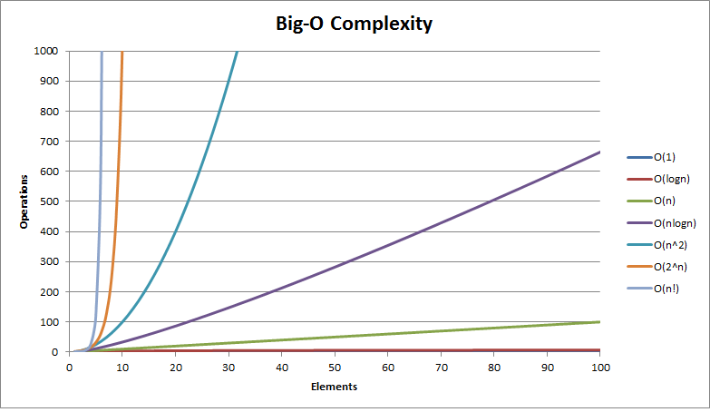
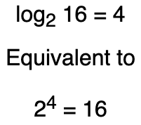

<br><br>

| Big O              | English Term  |
|--------------------|---------------|
| O(1)               | Constant      |
| O(log n)           | Logarithmic   |
| O(n)               | Linear        |
| O(n^2)             | Quadratic     |
| O(n^3)             | Cubic         |
| O(2^n)             | Exponential   |
| O(n!)              | Factorial     |

<br><br>

### Examples of Quadratic Time Complexity

When we encounter nested loops or other nested operations, we multiply the time complexity of the inner loop by the number of iterations of the outer loop.

```python
def duplicates_within_k(numbers, k):
    lst_length = len(numbers)

    if lst_length < 2 or k == 0:
          return False
    
    for i in range(lst_length):
        j = i + 1
        dist_remaining = k
        while dist_remaining > 0 and j < lst_length:
            if numbers[i] == numbers[j]:
                return True
            j += 1
            dist_remaining -= 1
    return False
```

### Examples of Logarithmic Time Complexity

If we reduce the size of a problem by dividing the remaining input at a constant rate with each iteration we often get a time complexity involving a logarithm.

```python
# Because we divide n by half with each iteration of the loop the time complexity is logarithmic. 
def binary_search(test_array, value):
    low = 0
    high = len(test_array) - 1
    while low <= high:
        mid = (low + high) // 2
        if test_array[mid] > value:
            high = mid - 1
        elif test_array[mid] < value:
            low = mid + 1
        else:
            return mid

    return None


# Because we divide n by 10 with each iteration of the loop the time complexity is logarithmic. 
def sum_digits(n):
    total = 0
    while n > 0:
        total += n % 10 # get last digit
        n //= 10        # remove last digit
    
    return total
```

